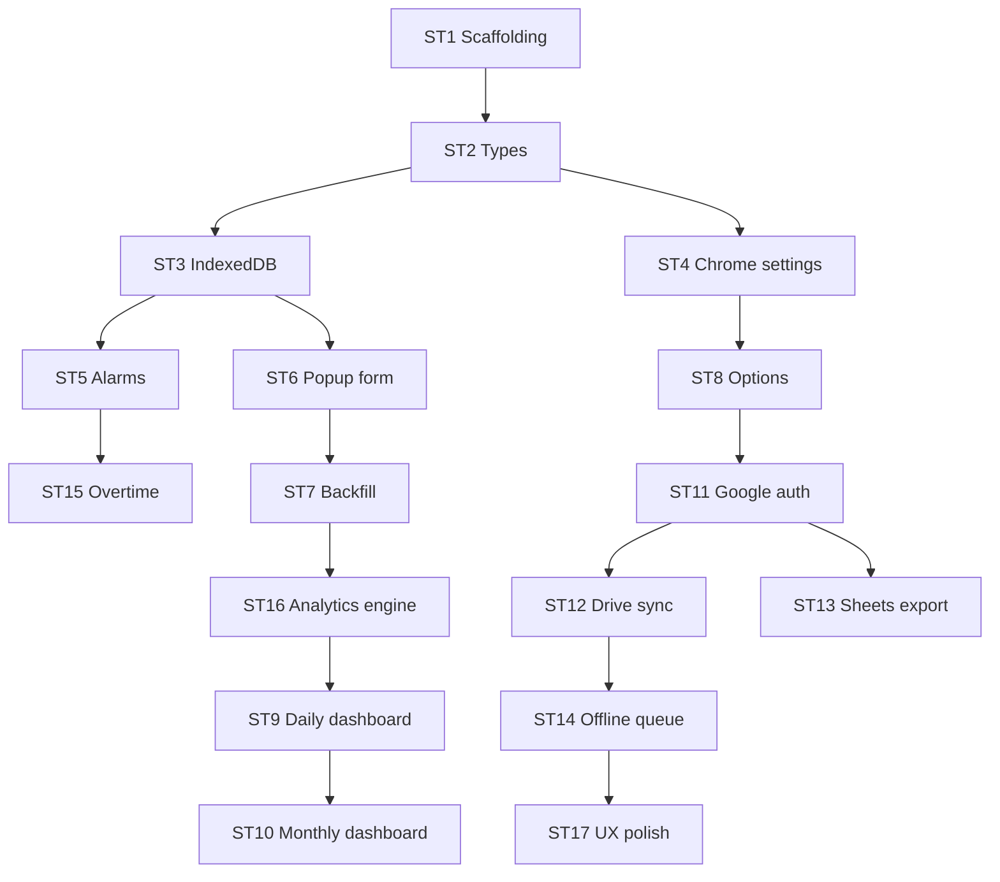

# Developer runbook — claiming sub-tasks to completion

This doc turns [IMPLEMENTATION_PLAN.md](./IMPLEMENTATION_PLAN.md) into something multiple developers (or parallel agent sessions) can execute without stepping on each other. The authoritative scope and acceptance criteria for each item stay in **§6 Sub-Tasks** of the plan; this file adds **dependencies, waves, contracts, and checkout hygiene**.

---

## 1. How work is structured

| Concept                            | Where it lives                                 |
| ---------------------------------- | ---------------------------------------------- |
| Scope, acceptance criteria, effort | Plan §6 (`SUB-TASK 1` … `17`)                  |
| File/box layout                    | Plan §2                                        |
| Schemas                            | Plan §4                                        |
| Timeline illustration              | Plan §7 (Gantt — adjust dates to your kickoff) |

Each sub-task is written to be **owned by one developer** end-to-end (implement + test + PR), unless your lead splits UI/backend within a task explicitly.

---

## 2. Dependency graph (what blocks what)

Only the **minimum** order is enforced; anything not connected can run in parallel once valid inputs exist.



**Parallelization highlights (after prerequisites land):**

- **After ST2:** ST3 and ST4 together.
- **After ST3 + ST4:** ST5, ST6, ST8 can proceed in parallel (ST8 only needs ST4).
- **After ST11:** ST12 and ST13 in parallel.
- **Dashboard track:** ST9 then ST10 (serialization is intentional — reuse patterns).

---

## 3. Execution waves (suggested staffing)

Use waves to **assign capacity** without re-negotiating the whole Gantt every day.

| Wave                 | Sub-tasks                        | Notes                                                                  |
| -------------------- | -------------------------------- | ---------------------------------------------------------------------- |
| **0 — Bootstrap**    | ST1                              | One owner; everyone else waits or reviews manifest/Vite setup.         |
| **1 — Contracts**    | ST2 → then ST3 + ST4             | Types land first; two devs on storage layers.                          |
| **2 — Core product** | ST5, ST6, ST8 (+ ST15 after ST5) | Highest parallelism; agree on message passing BG ↔ popup early.        |
| **3 — Depth**        | ST7 → ST16                       | Backfill before analytics engine per plan.                             |
| **4 — Insights**     | ST9 → ST10                       | Second dev can spike monthly UI behind feature flag if ST9 API stable. |
| **5 — Cloud**        | ST11 → ST12 ∥ ST13 → ST14        | Drive and Sheets share auth; coordinate quota/error UX.                |
| **6 — Ship**         | ST17                             | Last; touches manifest, commands, global polish.                       |

**Rough total** remains ~18.5 dev-days in the plan; calendar time shrinks with parallel waves and a stable `main`.

---

## 4. Claiming a sub-task (pickup checklist)

Before coding:

1. **Confirm prerequisites merged** (see §2 graph).
2. **Re-read plan §6** for that `SUB-TASK N` — acceptance criteria are non-negotiable.
3. **Identify integration surfaces** (§5 Handoff contracts below).
4. **Branch:** `feat/st{N}-{short-slug}` (e.g. `feat/st3-indexeddb`).
5. **If blocked:** comment with blocker (missing API from upstream task, spec ambiguity); escalate to tech lead rather than inventing new contracts.

While coding:

- Match paths and naming from plan §2.
- No new permissions in manifest without plan §5 alignment and security review note in PR.
- UI tasks: note popup dimensions and a11y requirements from the sub-task text.

Before PR:

- [ ] All acceptance criteria in plan §6 satisfied or explicitly documented as follow-up issue.
- [ ] `npm run lint` / `npm run test` (or project equivalents once ST1 exists) pass.
- [ ] For ST1+: extension loads unpacked from `dist/` (or `dev` flow) as described in ST1.

---

## 5. Handoff contracts (minimize merge pain)

These are the **interfaces downstream tasks assume**. If you change one, update this table and notify dependents.

| Producer | Consumers expect                                                                                             |
| -------- | ------------------------------------------------------------------------------------------------------------ |
| **ST2**  | Exported `TaskLog`, `UserSettings`, `DailyAnalytics` (and related unions) from `@shared/types/*`; no `any`.  |
| **ST3**  | Stable Dexie layer: CRUD + date range queries; `syncStatus` default; compound uniqueness documented in code. |
| **ST4**  | `getSettings` / `updateSettings` / defaults; `onSettingsChange` pattern for UI and background.               |
| **ST5**  | Alarms named and documented; notification click opens logging surface; respects settings + leave.            |
| **ST6**  | Writes only to IndexedDB for logs; validation rules stable for ST7/ST16.                                     |
| **ST11** | Token lifecycle abstracted in `googleAuth.ts`; no tokens in plaintext sync storage.                          |
| **ST12** | `syncVersion` / LWW behavior documented; queue hooks for ST14.                                               |
| **ST16** | Pure-ish analytics functions + performance budget; dashboard only reads aggregates.                          |

If a task needs a **temporary stub** (e.g. Google APIs not ready), stub at the service boundary with the same function signatures the plan implies.

---

## 6. PR title and description template

**Title:** `[ST{N}] Short description` — e.g. `[ST3] Dexie schema, migrations, and task log CRUD`

**Description:**

```markdown
## Sub-task

Implements plan §6 SUB-TASK N: [name]

## Acceptance criteria

- [ ] paste or link to plan checks you satisfied

## Out of scope

- [ ] what you did not do (if any)

## How to verify

1. …
2. …

## Depends on

- [ ] links to PRs/commits for upstream tasks
```

---

## 7. Optional: GitHub Issues backlog

If you use GitHub, create **one issue per SUB-TASK 1–17** with:

- **Title:** `[ST{N}] <name from plan heading>`
- **Body:** Link to `docs/IMPLEMENTATION_PLAN.md` anchored to §6, list acceptance criteria as checkboxes, paste dependency line from §2 above.

Example CLI (after `gh auth login`):

```bash
gh issue create --title "[ST1] Project scaffolding and build setup" \
  --body "See docs/IMPLEMENTATION_PLAN.md §6 SUB-TASK 1. Blocks: none. Unblocks: ST2."
```

Repeat for ST2–ST17, adjusting **Blocks / Unblocks** from the graph in §2.

---

## 8. Using this repo with Cursor / AI assistants

Paste when starting a session:

> Implement **SUB-TASK N** from `docs/IMPLEMENTATION_PLAN.md` only. Read §6 for acceptance criteria and §2 of `docs/DEVELOPER_RUNBOOK.md` for dependencies. Do not expand scope beyond that sub-task; if a dependency is missing, stop and list what must merge first.

This keeps each session aligned with the same contracts as human developers.

---

## Context recap

| Item         | Detail                                                         |
| ------------ | -------------------------------------------------------------- |
| **Purpose**  | Parallel-friendly execution on top of the implementation plan  |
| **Key file** | [docs/DEVELOPER_RUNBOOK.md](./DEVELOPER_RUNBOOK.md)            |
| **Plan**     | [docs/IMPLEMENTATION_PLAN.md](./IMPLEMENTATION_PLAN.md) §6     |
| **Next**     | Assign Wave 0 (ST1), then file ST2–ST4 issues and staff Wave 1 |
