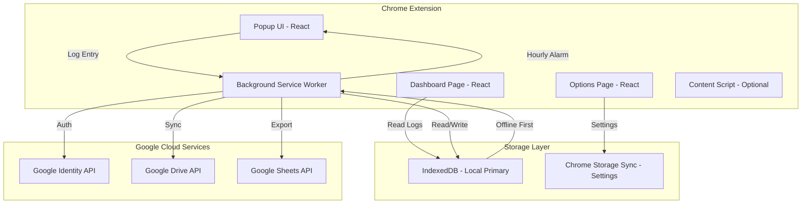
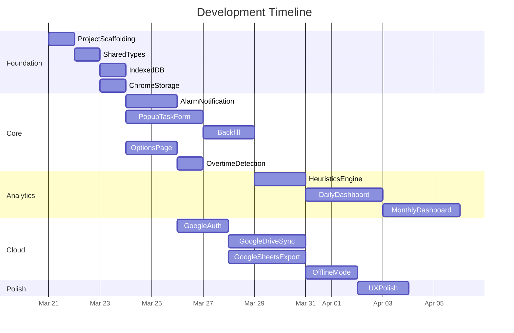
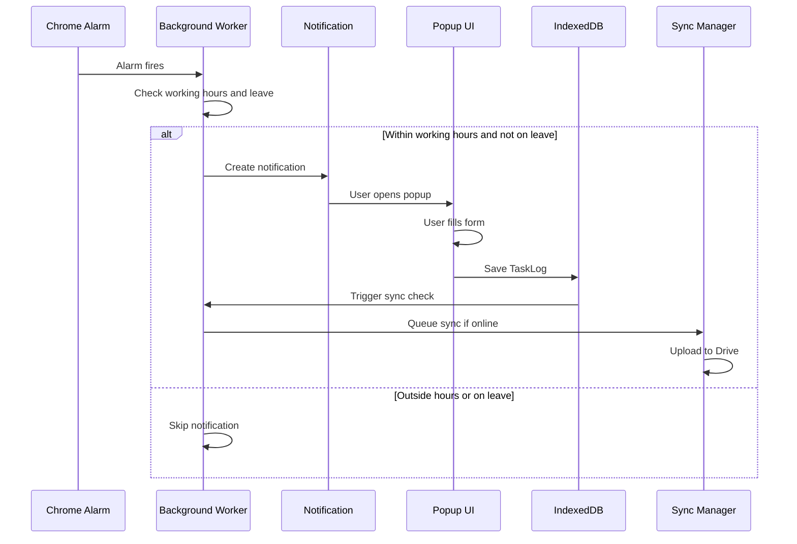
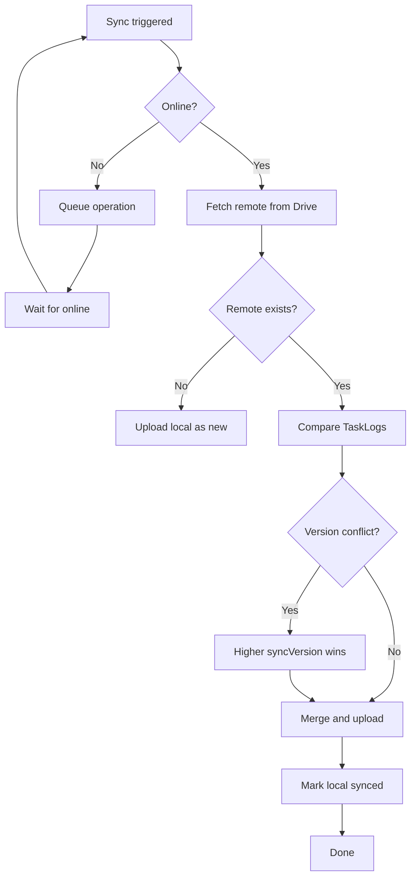

# Smart Work Tracker — Chrome Extension: Implementation Plan

Full implementation plan for a Chrome Extension-based task tracking system with hourly nudges, structured logs, analytics, Google account sync, and Google Sheets export.

---

## 1. High-Level Architecture



---

## 2. Chrome Extension File Structure

```
chrome-extension-task/
├── public/
│   ├── manifest.json
│   ├── icons/
│   │   ├── icon-16.png
│   │   ├── icon-48.png
│   │   └── icon-128.png
│   ├── popup.html
│   ├── options.html
│   └── dashboard.html
├── src/
│   ├── background/
│   │   ├── index.ts                  # Service worker entry
│   │   ├── alarmManager.ts         # Hourly alarm scheduling
│   │   ├── notificationManager.ts  # Chrome notifications
│   │   ├── syncManager.ts          # Google Drive sync
│   │   └── offlineQueue.ts         # Offline operation queue
│   ├── popup/
│   │   ├── index.tsx
│   │   ├── App.tsx
│   │   └── components/
│   │       ├── TaskLogForm.tsx
│   │       ├── BlockerInput.tsx
│   │       ├── MeetingInput.tsx
│   │       ├── AdhocTaskInput.tsx
│   │       ├── QuickActions.tsx
│   │       └── BackfillSelector.tsx
│   ├── options/
│   │   ├── index.tsx
│   │   ├── App.tsx
│   │   └── components/
│   │       ├── WorkingHoursConfig.tsx
│   │       ├── NotificationSettings.tsx
│   │       ├── GoogleAccountLink.tsx
│   │       ├── ExportSettings.tsx
│   │       └── LeaveCalendar.tsx
│   ├── dashboard/
│   │   ├── index.tsx
│   │   ├── App.tsx
│   │   └── components/
│   │       ├── DailyView.tsx
│   │       ├── MonthlyView.tsx
│   │       ├── TimeBreakdownChart.tsx
│   │       ├── ProductivityScore.tsx
│   │       ├── BlockerFrequency.tsx
│   │       ├── OvertimeTracker.tsx
│   │       └── InsightCards.tsx
│   ├── shared/
│   │   ├── types/
│   │   │   ├── taskLog.ts
│   │   │   ├── settings.ts
│   │   │   └── analytics.ts
│   │   ├── storage/
│   │   │   ├── db.ts
│   │   │   ├── settingsStore.ts
│   │   │   └── migrationManager.ts
│   │   ├── services/
│   │   │   ├── googleAuth.ts
│   │   │   ├── googleDrive.ts
│   │   │   ├── googleSheets.ts
│   │   │   └── analyticsEngine.ts
│   │   ├── utils/
│   │   │   ├── time.ts
│   │   │   ├── validators.ts
│   │   │   └── heuristics.ts
│   │   └── constants.ts
├── tests/
│   ├── unit/
│   │   ├── alarmManager.test.ts
│   │   ├── analyticsEngine.test.ts
│   │   ├── offlineQueue.test.ts
│   │   └── time.test.ts
│   └── integration/
│       ├── syncFlow.test.ts
│       └── taskLogFlow.test.ts
├── package.json
├── tsconfig.json
├── vite.config.ts
├── tailwind.config.js
├── postcss.config.js
├── .eslintrc.cjs
├── .prettierrc
└── README.md
```

---

## 3. Tech Stack

| Layer            | Choice                         | Rationale                          |
| ---------------- | ------------------------------ | ---------------------------------- |
| Language         | TypeScript                     | Type safety, better DX             |
| UI Framework     | React 18                       | Component model, ecosystem         |
| Build Tool       | Vite + CRXJS plugin            | Fast HMR, Chrome extension support |
| Styling          | Tailwind CSS                   | Small bundle, consistent design    |
| State Management | Zustand                        | Lightweight, minimal boilerplate   |
| Local DB         | Dexie.js (IndexedDB)           | Typed, offline-first               |
| Settings Sync    | Chrome Storage Sync API        | Cross-device for small config      |
| Charts           | Recharts                       | React-native, lightweight          |
| Google APIs      | `@googleapis` REST via `fetch` | Smaller bundle than heavy SDKs     |
| Testing          | Vitest + Testing Library       | Fast, Vite-native                  |

---

## 4. Data Schema Design

### 4.1 TaskLog (IndexedDB — primary data)

```typescript
interface TaskLog {
  id: string; // UUID v4
  date: string; // ISO date: "2026-03-20"
  timeSlotStart: string; // ISO datetime with offset
  timeSlotEnd: string;
  taskDescription: string;
  timeSpentMinutes: number; // 0-60

  hasBlocker: boolean;
  blockerDescription?: string;

  nextPlan: string;
  linkedTicket?: string;

  isAdhoc: boolean;
  adhocDescription?: string;
  adhocLinkedStory?: string;

  hadMeeting: boolean;
  meetingDetails?: string;
  meetingDurationMinutes?: number;

  isOvertime: boolean;
  isBackfill: boolean;

  createdAt: string;
  updatedAt: string;
  syncStatus: 'pending' | 'synced' | 'conflict';
  syncVersion: number;
}
```

### 4.2 UserSettings (Chrome Storage Sync)

```typescript
interface UserSettings {
  loginTime: string; // "09:00"
  logoutTime: string; // "18:00"
  timezone: string; // e.g. "Asia/Kolkata"
  notificationIntervalMinutes: number;
  notificationSound: boolean;
  isOnLeave: boolean;
  leaveStartDate?: string;
  leaveEndDate?: string;
  googleAccountLinked: boolean;
  autoExportToSheets: boolean;
  sheetId?: string;
  lastSyncTimestamp?: string;
}
```

### 4.3 DailyAnalytics (computed, IndexedDB cache)

```typescript
interface DailyAnalytics {
  date: string;
  totalProductiveMinutes: number;
  totalMeetingMinutes: number;
  totalAdhocMinutes: number;
  totalOvertimeMinutes: number;
  blockerCount: number;
  missedSlots: number;
  productivityScore: number; // 0-100
  topBlockers: string[];
  suggestions: string[];
}
```

---

## 5. Manifest (MV3) — Permissions Summary

- **permissions:** `alarms`, `notifications`, `storage`, `identity`, `offscreen` (as needed)
- **host_permissions:** `https://www.googleapis.com/*`, `https://sheets.googleapis.com/*`, `https://oauth2.googleapis.com/*`
- **background:** service worker (`type: "module"`)
- **oauth2:** `drive.file`, `spreadsheets` scopes
- Document full JSON in repo when scaffolding

---

## 6. Sub-Tasks (Scope, Acceptance Criteria, Constraints)

### SUB-TASK 1: Project Scaffolding and Build Setup

**Scope:** Vite + CRXJS + React + TypeScript; Tailwind; ESLint/Prettier/Vitest; popup/options/dashboard entries; `manifest.json`.

**Acceptance criteria:**

1. `npm run dev` produces a loadable unpacked extension.
2. Popup, Options, Dashboard render placeholder React.
3. Tailwind works on all pages.
4. `npm run build` produces loadable `dist/`.
5. `npm run test` passes; `npm run lint` passes.

**Constraints:** MV3 only; popup bundle target &lt; ~200KB gzipped; use npm or pnpm (not yarn).

**Effort:** ~1 day

---

### SUB-TASK 2: Shared Types and Constants

**Scope:** `src/shared/types/`, `constants.ts`.

**Acceptance criteria:**

1. Interfaces from section 4 defined and exported.
2. No `any`; time as ISO 8601 strings.
3. Path aliases (`@shared/...`) configured.

**Constraints:** No runtime code in pure type files; prefer union types over enums.

**Effort:** ~0.5 day

---

### SUB-TASK 3: IndexedDB (Dexie)

**Scope:** `db.ts`, tables `taskLogs`, `dailyAnalytics`, migrations.

**Acceptance criteria:**

1. CRUD and queries by date/date range.
2. Compound uniqueness on date + time slot start (or equivalent guard).
3. Default `syncStatus: 'pending'`.
4. Unit tests for core operations.

**Constraints:** Dexie only; DB name `SmartWorkTrackerDB`.

**Effort:** ~1 day

---

### SUB-TASK 4: Chrome Storage Settings

**Scope:** `settingsStore.ts` — get/update/reset on `chrome.storage.sync`.

**Acceptance criteria:**

1. Defaults on first install (login/logout/timezone).
2. Partial merge updates.
3. `chrome.storage.onChanged` observable pattern.
4. Tests with mocked `chrome.storage.sync`.

**Constraints:** Stay under sync quotas; never store full logs in sync storage.

**Effort:** ~0.5 day

---

### SUB-TASK 5: Background — Alarms and Notifications

**Scope:** `alarmManager.ts`, `notificationManager.ts`; click opens popup.

**Acceptance criteria:**

1. Hourly alarms inside working hours; timezone-aware.
2. No alarms on leave; reschedule on settings change.
3. Notification → open logging UI.
4. Use `chrome.alarms`, not in-memory timers only.

**Constraints:** Event-driven MV3 worker; dev can use 1-min alarms for testing only in dev config.

**Effort:** ~1.5 days

---

### SUB-TASK 6: Popup — Task Log Form

**Scope:** Full mandatory structure: task, time, blockers, next plan, ticket, adhoc, meetings, overtime hints.

**Acceptance criteria:**

1. Fast render; validation before save.
2. Save to IndexedDB only; toast/feedback.
3. Slot auto-detect + optional override for backfill prep.
4. `Ctrl/Cmd+Enter` submit; optional draft in `chrome.storage.local`.

**Constraints:** Popup ~400×600; Zustand for form state; max lengths on text fields.

**Effort:** ~2.5 days

---

### SUB-TASK 7: Backfill / Missed Entries

**Scope:** Missed slots list; `isBackfill: true`; 48h window.

**Acceptance criteria:**

1. Badge count for today’s misses.
2. Only working-hour slots; respects leave and partial days.
3. Tests for missed-slot detection.

**Constraints:** No backfill older than policy (e.g. 48h).

**Effort:** ~1.5 days

---

### SUB-TASK 8: Options Page

**Scope:** Hours, timezone, notifications, leave range, Google link placeholder, export toggles.

**Acceptance criteria:**

1. Persist via settings store; validations (login &lt; logout).
2. Leave immediately stops scheduling (verify via alarms).
3. Accessible labels and focus.

**Constraints:** No Google API calls in this task beyond future hook points.

**Effort:** ~2 days

---

### SUB-TASK 9: Dashboard — Daily View

**Scope:** Charts, timeline, blockers, productivity score, suggestions.

**Acceptance criteria:**

1. Date picker; data from IndexedDB.
2. Recharts only; target render budget (~500ms).
3. Heuristics for suggestions (missed slots, meeting %, blockers).
4. Empty state.

**Constraints:** Aggregation logic belongs in `analyticsEngine.ts`.

**Effort:** ~2.5 days

---

### SUB-TASK 10: Dashboard — Monthly View

**Scope:** Heatmap, trends, top blockers, overtime patterns, summary cards.

**Acceptance criteria:**

1. Month navigation; ~30 days loads within ~1s target.
2. Partial months handled.

**Constraints:** Reuse chart patterns; aggregate in engine, not components.

**Effort:** ~2.5 days

---

### SUB-TASK 11: Google Authentication

**Scope:** `chrome.identity.getAuthToken`, link/unlink UI.

**Acceptance criteria:**

1. OAuth consent; show linked email; revoke on unlink.
2. Errors for deny/offline documented in UI.

**Constraints:** Minimal scopes; token handling per Chrome Identity (no raw token in plaintext storage).

**Effort:** ~1.5 days

---

### SUB-TASK 12: Google Drive Sync

**Scope:** AppData JSON file; periodic + on-demand sync; versioning LWW.

**Acceptance criteria:**

1. First sync creates file; merge by `syncVersion`.
2. Offline queue integration; backoff retries.
3. Same account, two devices: converges without duplicate primary keys.

**Constraints:** REST v3; non-blocking UI; reasonable file size assumptions.

**Effort:** ~3 days

---

### SUB-TASK 13: Google Sheets Export

**Scope:** Manual + optional daily auto-export; monthly sheets; column layout per spec.

**Acceptance criteria:**

1. Create/append; daily row updates by TaskLog id.
2. Respect quotas; batch where possible.
3. Skip auto-export on leave.

**Constraints:** Sheets API v4 REST; document quota behavior.

**Effort:** ~2.5 days

---

### SUB-TASK 14: Offline Queue

**Scope:** Queue sync/export when offline; FIFO; persistence.

**Acceptance criteria:**

1. Online/offline indicator UX.
2. Max queue size and retry policy.

**Constraints:** `navigator.onLine` + events; cap queue length.

**Effort:** ~1.5 days

---

### SUB-TASK 15: Overtime Detection

**Scope:** Auto-flag after logout; manual override; analytics bucket.

**Acceptance criteria:**

1. Timezone-safe; DST cases tested.
2. Optional different notification styling for overtime window.

**Constraints:** Logic uses configured timezone, not only system default.

**Effort:** ~1 day

---

### SUB-TASK 16: Heuristics / Analytics Engine

**Scope:** `heuristics.ts`, `analyticsEngine.ts`; daily + monthly aggregates.

**Acceptance criteria:**

1. Deterministic scoring formula (documented in code).
2. &lt; ~100ms for monthly compute on fixture data.
3. Optional Web Worker if needed to avoid UI jank.

**Constraints:** No external AI in MVP.

**Effort:** ~2 days

---

### SUB-TASK 17: UX Polish

**Scope:** Smart defaults, `chrome.commands` shortcut, loading/error/empty states, toasts.

**Acceptance criteria:**

1. Recent ticket suggestions from local data only.
2. Command opens popup from browser.

**Constraints:** Document command in manifest; no cross-user leakage on shared machines.

**Effort:** ~1.5 days

---

## 7. Development Timeline (Gantt)



**Rough total:** ~18.5 dev days (~4 calendar weeks with buffer)

---

## 8. Sequence: Hourly Log Flow



---

## 9. Sync and Conflict Resolution



---

## 10. Storage Tradeoffs (Summary)

| Option                  | Pros                                     | Cons                                            |
| ----------------------- | ---------------------------------------- | ----------------------------------------------- |
| **IndexedDB (primary)** | Large payload, offline, fast local reads | No native cross-device; needs sync layer        |
| **Chrome Storage Sync** | Built-in cross-device for small data     | Strict size limits; not for logs                |
| **Google Drive (file)** | User-owned, no new backend, cross-device | Conflict handling required; not real-time       |
| **Firebase**            | Real-time, auth ecosystem                | New infra, cost, privacy review, heavier client |

**Recommendation:** IndexedDB + optional Drive AppData JSON for MVP sync; Firebase only if real-time/team features justify it.

---

## 11. Risks and Mitigations

| Risk                 | Mitigation                                               |
| -------------------- | -------------------------------------------------------- |
| MV3 worker lifecycle | Persist with `chrome.alarms`; avoid only in-memory state |
| API quotas           | Batching, backoff, backoff-aware UX                      |
| IndexedDB issues     | Dexie migrations; Drive as backup                        |
| Popup size           | Progressive disclosure, tabs/accordion                   |
| Timezones / DST      | IANA tz + ISO strings; tests around boundaries           |
| Sync conflicts       | Version LWW; optional manual conflict UI later           |
| Web Store review     | Minimal permissions; clear privacy policy                |

---

## 12. Future Enhancements

1. AI summaries (local or API) for pattern narratives.
2. Jira/GitHub deep links and ticket metadata.
3. Team/anonymized dashboards (opt-in).
4. Content script for context-aware suggestions (careful permissions).
5. Pomodoro mode within hours.
6. Mobile PWA read-only companion.
7. Slack daily digest.

---

## 13. Security and Privacy (Baseline)

- Local-first; cloud sync opt-in.
- OAuth via Chrome Identity; minimal scopes.
- Drive AppData reduces accidental user deletion exposure.
- No third-party telemetry in MVP.
- CSP and manifest permissions minimized.
- “Clear all data” in options.

---

## 14. Running the plan with multiple developers

For **dependency order, parallel waves, handoff contracts, PR templates, and optional GitHub issue creation**, use the companion doc:

**[docs/DEVELOPER_RUNBOOK.md](./DEVELOPER_RUNBOOK.md)**

It does not duplicate acceptance criteria here — §6 remains the source of truth per sub-task.

---

## Context recap

| Item     | Detail                                                                                                               |
| -------- | -------------------------------------------------------------------------------------------------------------------- |
| **Done** | Plan saved to versioned markdown for the team                                                                        |
| **File** | [docs/IMPLEMENTATION_PLAN.md](docs/IMPLEMENTATION_PLAN.md)                                                           |
| **Next** | Scaffold repo (ST1), then types + storage (ST2–ST4); assign waves per [DEVELOPER_RUNBOOK.md](./DEVELOPER_RUNBOOK.md) |
